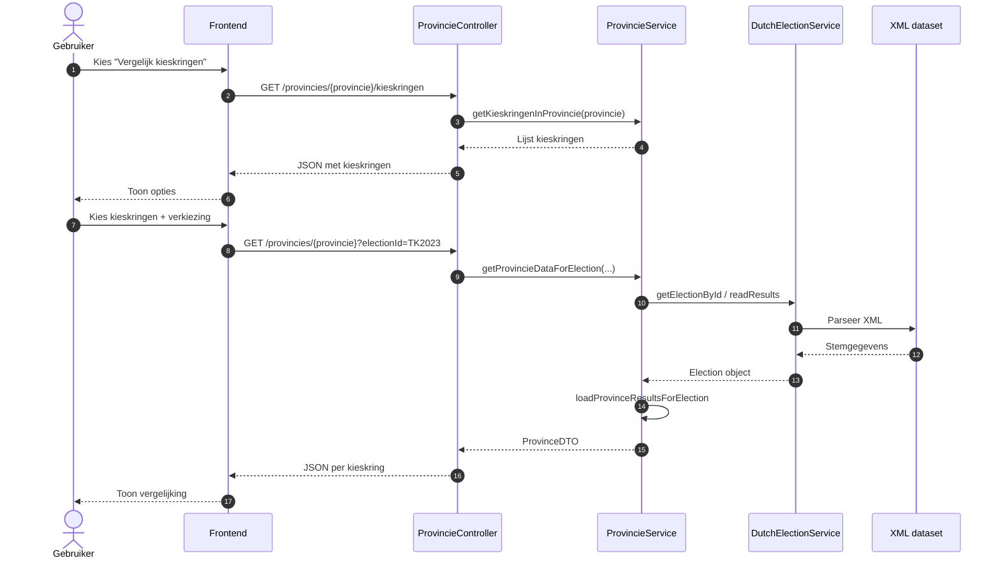

```mermaid
sequenceDiagram
    autonumber
    actor U as Gebruiker
    participant UI as Frontend
    participant API as ProvincieController
    participant SVC as ProvincieService
    participant ES as DutchElectionService
    participant DATA as XML dataset

    U->>UI: Kies "Vergelijk kieskringen"
    UI->>API: GET /provincies/{provincie}/kieskringen
    API->>SVC: getKieskringenInProvincie(provincie)
    SVC-->>API: Lijst kieskringen
    API-->>UI: JSON met kieskringen
    UI-->>U: Toon opties
    U->>UI: Kies kieskringen + verkiezing
    UI->>API: GET /provincies/{provincie}?electionId=TK2023
    API->>SVC: getProvincieDataForElection(...)
    SVC->>ES: getElectionById / readResults
    ES->>DATA: Parseer XML
    DATA-->>ES: Stemgegevens
    ES-->>SVC: Election object
    SVC->>SVC: loadProvinceResultsForElection
    SVC-->>API: ProvinceDTO
    API-->>UI: JSON per kieskring
    UI-->>U: Toon vergelijking
```